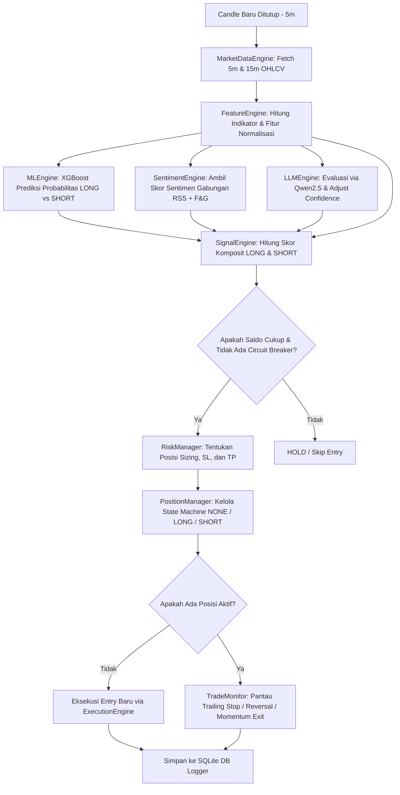

# Rangkuman & Penjelasan Project: AI Trading (Scalping Expert Advisor)

Project ini adalah sebuah sistem trading otomatis (Expert Advisor / EA) berfrekuensi tinggi (scalping) untuk kontrak berjangka cryptocurrency (Crypto Futures - khususnya BTC/USDT) di Binance USD-M Futures. Sistem ini menggabungkan analisis teknikal tradisional, pemodelan prediktif berbasis Machine Learning (XGBoost), analisis sentimen publik secara real-time dari 7 sumber, dan penyempurnaan keputusan (confidence adjustment) berbasis AI menggunakan Large Language Model (LLM).

Sistem ini didesain secara agresif untuk mencari peluang scalping cepat pada timeframe 5 menit (5m) dan tren pendukung pada timeframe 15 menit (15m).

---

## 1. Tech Stack (Teknologi yang Digunakan)

Berikut adalah daftar teknologi dan library utama yang menyusun sistem AI Trading ini:

*   **Bahasa Pemrograman:** Python 3.x
*   **Akses API Exchange (Crypto Futures):**
    *   `ccxt` (CryptoCurrency eXchange Trading library): Digunakan untuk melakukan koneksi ke Binance Futures API (Testnet/Demo maupun Live), memeriksa saldo, menyinkronkan posisi aktif, serta mengeksekusi order (Market/Limit, Stop Loss, Take Profit).
*   **Machine Learning & Prediksi Arah:**
    *   `xgboost` (Extreme Gradient Boosting): Classifier biner utama yang dilatih untuk memprediksi arah pergerakan harga berikutnya (LONG = `0` vs SHORT = `1`).
    *   `scikit-learn` (sklearn): Digunakan untuk preprocessing data, pembagian dataset training/validasi, penghitungan performa klasifikasi (`classification_report`), serta penyeimbangan bobot kelas (`compute_sample_weight`).
*   **Analisis Sentimen Publik (Real-time & Background):**
    *   `vaderSentiment` & `textblob`: Library pemrosesan bahasa alami (NLP) untuk menganalisis teks berita/artikel dan menghasilkan skor sentimen polaritas.
    *   `feedparser`: Parser RSS Feed untuk membaca dan mengekstrak berita utama dari berbagai situs crypto dan media sosial secara berkala.
*   **Pengolahan Data & Komputasi Numerik:**
    *   `pandas` & `numpy`: Pengolahan data historis OHLCV (Open, High, Low, Close, Volume), pembuatan indikator teknikal kustom, dan normalisasi fitur untuk model ML.
*   **Advisor Berbasis AI (LLM):**
    *   `ollama`: Digunakan untuk berinteraksi dengan LLM lokal (menggunakan model **Qwen 2.5 (7B)**) untuk menganalisis keselarasan parameter teknikal dan sentimen secara holistik.
*   **Database & Logging:**
    *   `sqlite3` (SQLite): Menyimpan log secara lokal ke database relasional (`logs/trading.db`). SQLite mencatat data sinyal yang dihasilkan, eksekusi & detail trading (PnL, durasi, alasan exit), indikator teknikal per candle, serta performa harian.
    *   `logging` (RotatingFileHandler): Logging internal sistem ke terminal secara visual dan file fisik (`logs/ea.log`).
*   **Koneksi HTTP & Asinkron:**
    *   `requests`, `aiohttp`, `httpx`: Untuk memanggil API eksternal (Ollama, API sentimen Fear & Greed) secara cepat.
    *   `python-dotenv`: Manajemen variabel lingkungan (memuat API keys dan secrets dari file `.env`).

---

## 2. Alur Kerja Sistem (Pipeline per Candle 5 Menit)

Setiap kali candle 5 menit (timeframe eksekusi) ditutup, sistem akan menjalankan alur evaluasi terintegrasi (Orchestrator pipeline di `main.py`) sebagai berikut:



### Penjelasan Detail Tiap Tahap:

1.  **MarketDataEngine (`core/market_data_engine.py`):**
    Mengunduh data pasar OHLCV terbaru untuk BTC/USDT pada timeframe eksekusi (5m) dan timeframe tren (15m). Engine ini mendeteksi kapan lilin (candle) baru ditutup secara presisi untuk menghindari duplikasi data.
2.  **FeatureEngine (`core/feature_engine.py`):**
    Menghitung indikator teknikal dasar seperti EMA 5, EMA 20, RSI(14), MACD(12,26,9), ATR(14), ADX(14), VWAP, dan Bollinger Bands(20,2). Selain itu, ia membuat fitur ternormalisasi untuk model ML seperti jarak harga ke EMA/VWAP (`ema5_dist`, `vwap_dist`), slope RSI/MACD (`rsi_slope`, `macd_slope`), dan posisi relatif harga pada Bollinger Bands (`bb_dist`).
3.  **MLEngine (`core/ml_engine.py`):**
    Mengirimkan fitur teknikal ternormalisasi ke model XGBoost biner yang telah terlatih. Model ini memberikan output probabilitas harga bergerak naik (`long_prob`) atau turun (`short_prob`).
4.  **SentimentEngine (`core/sentiment_engine.py`):**
    Berjalan di latar belakang (background thread) untuk memperbarui skor sentimen global berkisar antara `0.0` (sangat bearish) hingga `1.0` (sangat bullish) dari 7 sumber gratis:
    *   Index Fear & Greed Crypto (API)
    *   CoinTelegraph RSS
    *   Decrypt RSS
    *   Binance Announcements RSS
    *   Bitcoin.com RSS
    *   CryptoPotato RSS
    *   YouTube RSS Feeds (Coin Bureau, Altcoin Daily, Crypto Banter)
    Juga mendeteksi keyword ekstrim (seperti *exchange hack, lawsuit, flash crash*) untuk memicu perlindungan darurat (*extreme event warning*).
5.  **LLMEngine (`core/llm_engine.py`):**
    Mengirim ringkasan data pasar, sinyal ML, dan kondisi sentimen ke LLM lokal (Ollama Qwen2.5:7b). LLM mengevaluasi apakah ada konflik indikator (misal, ML menyuruh LONG tetapi sentimen sangat buruk) dan memberikan penyesuaian keyakinan kecil (`confidence_adjustment`) di kisaran `[-0.05, +0.05]` (maksimal 5% pengaruh).
6.  **SignalEngine (`core/signal_engine.py`):**
    Menggabungkan semua komponen di atas untuk menghasilkan skor komposit akhir bagi arah LONG dan SHORT. Bobot penggabungan yang diatur pada `config.py` adalah:
    *   **XGBoost ML Probability:** 70% (`WEIGHT_ML`)
    *   **Technical Indicators Bias:** 10% (`WEIGHT_TECH`)
    *   **Composite Sentiment:** 10% (`WEIGHT_SENTIMENT`)
    *   **LLM Advisor Adjustment:** 10% (`WEIGHT_LLM`)
    Sinyal terpilih (LONG/SHORT) disaring menggunakan threshold keyakinan. Jika skor berada di bawah threshold (misal `< 0.52`), aksi dibatalkan atau berada dalam posisi `HOLD`.
7.  **RiskManager (`core/risk_manager.py`):**
    *   *Circuit Breakers:* Melindungi akun dengan memblokir trade baru jika kerugian harian melebihi 2% (`MAX_DAILY_LOSS_PCT`) atau drawdown akun melebihi 10% (`MAX_DRAWDOWN_PCT`).
    *   *Position Sizing:* Menghitung volume trading aman (biasanya menggunakan margin ~5% dari total ekuitas akun dengan leverage 50x).
    *   *SL/TP Targets:* Menentukan target Stop Loss (SL) dan Take Profit (TP) secara dinamis menggunakan kelipatan ATR atau target persentase tetap (default: 0.12% untuk TP / ~6% ROI pada 50x, dan 0.05% untuk SL / ~2.5% loss pada 50x).
8.  **PositionManager (`core/position_manager.py`):**
    Mengelola siklus posisi trading menggunakan state machine (`NONE`, `LONG`, `SHORT`). Ia mengatur kapan posisi dibuka, kapan dinonaktifkan, serta mengoordinasikan pembalikan posisi secara instan (*reversal*) jika sinyal arah berlawanan muncul dengan keyakinan yang sangat tinggi (threshold `>= 0.52`).
9.  **TradeMonitor (`core/trade_monitor.py`):**
    Bertugas memantau posisi yang sedang terbuka pada setiap penutupan candle 5m.
    *   *Hold Scoring:* Menilai kesehatan posisi (dari rentang skor `0` sampai `6`) berdasarkan 6 faktor (arah EMA, momentum MACD, RSI slope, stabilitas ATR, volume transaksi, dan ketiadaan sinyal berlawanan). Jika skor kesehatan berada di bawah `3.5`, posisi ditutup lebih awal (*close early*) karena hilangnya momentum.
    *   *Hold Duration:* Membatasi waktu penahanan posisi berdasarkan kekuatan tren ADX (misal, maksimal 5 menit jika tren lemah, atau hingga 45 menit jika tren sangat kuat).
    *   *Trailing Stop:* Mengetatkan Stop Loss secara otomatis mengikuti pergerakan harga yang menguntungkan.
10. **DBLogger (`core/logger.py`):**
    Mencatat seluruh detail sinyal dan perdagangan yang sukses atau gagal ke database SQLite agar dapat digunakan untuk evaluasi performa ke depannya.

---

## 3. Mode Operasional Bot (`main.py`)

Bot trading ini dapat dijalankan dalam beberapa mode melalui argumen Command Line Interface (CLI):

1.  **Mode Live/Demo Testnet (Default):**
    ```bash
    python main.py
    ```
    Mengeksekusi perdagangan scalping secara real-time pada Binance Futures Testnet menggunakan saldo simulasi (aman untuk uji coba).
2.  **Mode Dry Run (Hanya Sinyal):**
    ```bash
    python main.py --dry-run
    ```
    Bot berjalan menganalisis pasar, mencari sinyal, dan memanggil model ML/LLM secara real-time, namun **tidak menaruh order sama sekali** ke bursa Binance. Sangat cocok untuk menguji kestabilan bot.
3.  **Mode Force Retrain (Pelatihan Ulang Model ML):**
    ```bash
    python main.py --retrain
    ```
    Menghapus model lama dan melatih ulang XGBoost Classifier menggunakan data historis yang tersedia (atau dataset tiruan berkualitas tinggi `synthetic_ohlcv.csv` jika ada).
4.  **Mode Backtest (Pengujian Historis):**
    ```bash
    python main.py --backtest
    ```
    Menjalankan pengujian mundur secara *walk-forward* menggunakan data historis (default 90 hari terakhir) dengan menerapkan model biaya transaksi riil (fee 0.04%, slippage 0.05%, dan biaya pendanaan/funding fee setiap 8 jam).

---

## 4. Analisis Performa Model & Pelatihan (`training_report.md`)

Berdasarkan laporan pelatihan terbaru, model XGBoost memiliki performa sebagai berikut:

*   **Dataset Pelatihan:** Menggunakan dataset sintetis berkualitas tinggi sebanyak 100.000 candle berkecepatan tinggi dengan variasi noise harga representatif untuk menghindari overfitting.
*   **Akurasi Klasifikasi Validasi (Out-Of-Sample):** **84.0%** (Sangat tinggi untuk perdagangan biner scalping futures).
    *   Precision LONG: **83%**
    *   Precision SHORT: **85%**
*   **Analisis Kepentingan Fitur (Feature Importance):**
    1.  `rsi_slope` (55.3%): Kecepatan pergerakan RSI menjadi faktor dominan untuk mendeteksi perubahan momentum mendadak.
    2.  `ema5_dist` (20.8%): Jarak harga ke rata-rata pergerakan cepat (EMA 5) untuk mencegah masuk di harga jenuh.
    3.  `bb_dist` (4.2%): Posisi relatif harga terhadap Bollinger Bands.
    4.  `volume_change_pct` (4.0%): Konfirmasi volume transaksi.
    5.  `macd_slope` (2.8%): Momentum histogram MACD.
